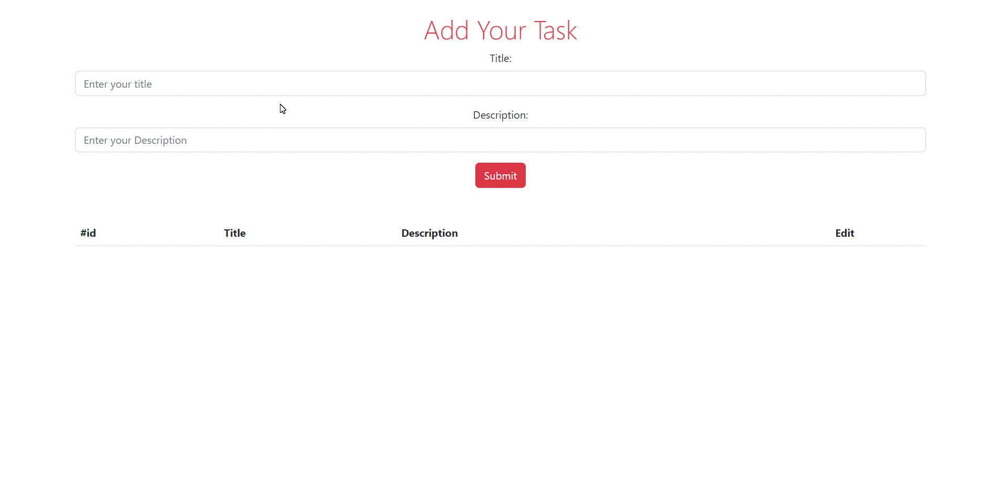
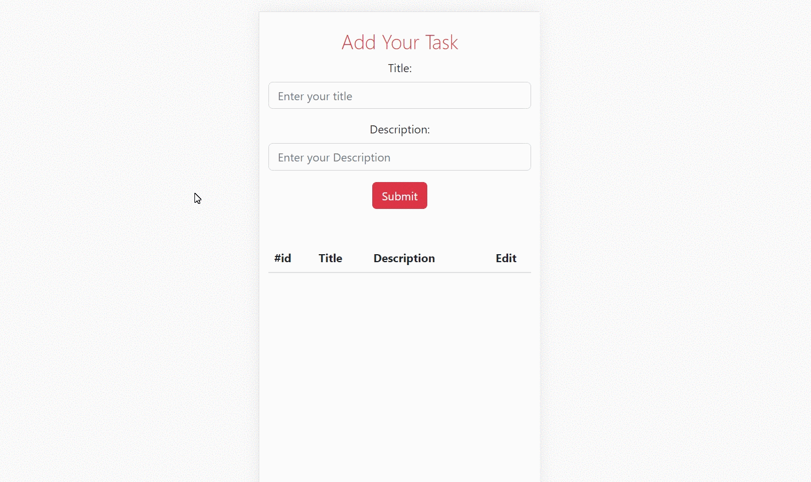

# Project Task Tracker

## Description

Project aims to create a Task Tracker App.

## Problem Statement

- We are adding a new project to our portfolios. So you and your colleagues have started to work on the project.

### Screenshot
💻-Desktop-view
 

 
📱-Mobile-view
 

### Links

- Solution URL: [Click here](https://github.com/aLpSabre/task-tracker)
- Live Site URL: [Click here](https://alpsabre.github.io/task-tracker/)

## Objective

Build a Task Tracker App using ReactJS.

### At the end of the project, following topics are to be covered;

- HTML

- CSS

- JS

- ReactJS

- Axios

